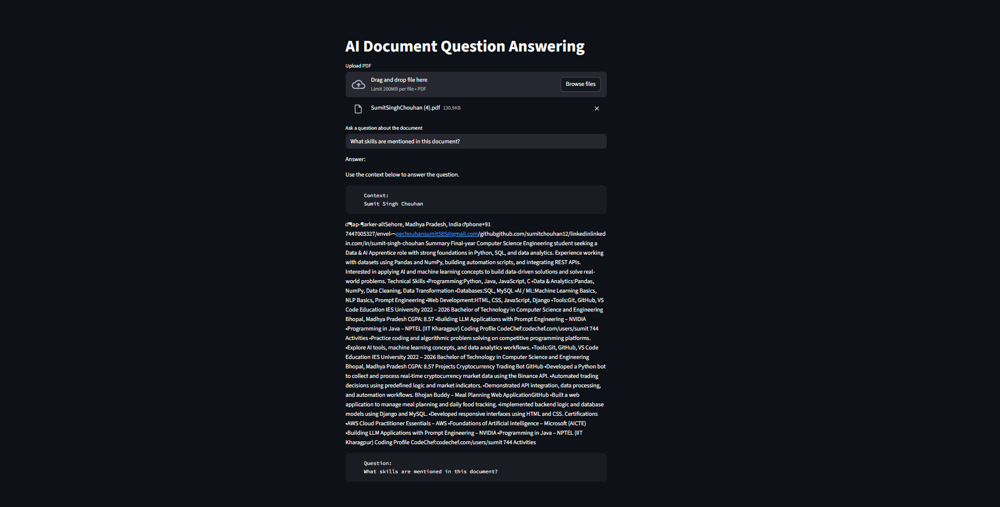

# 📄 AI Document Question Answering (RAG)

An AI-powered **Document Question Answering System** built using **Retrieval-Augmented Generation (RAG)**.

Upload a **PDF document** and ask questions in natural language.  
The system retrieves relevant sections from the document and generates accurate answers using an AI model.

---

# 🚀 Features

📄 Upload any PDF document  
🤖 Ask questions about the document  
🔍 Semantic search using vector embeddings  
🧠 AI-generated answers using LLM  
🖥️ Interactive web interface with Streamlit  

---

# 🧠 How It Works

This project follows the **RAG (Retrieval-Augmented Generation)** architecture.

PDF Upload
↓
Document Loader
↓
Text Chunking
↓
Embeddings Generation
↓
Vector Database (FAISS)
↓
Retriever
↓
LLM Response Generation

---

# 🛠️ Tech Stack

| Technology | Purpose |
|------------|--------|
| Python | Core programming language |
| LangChain | LLM workflow orchestration |
| FAISS | Vector similarity search |
| HuggingFace Transformers | LLM model inference |
| Sentence Transformers | Document embeddings |
| Streamlit | Web application interface |

---

# 📂 Project Structure

document-qa-llm
│
├── app.py
├── requirements.txt
├── README.md
├── .gitignore
│
├── data
│ └── sample.pdf
│
├── utils
│ ├── loader.py
│ └── qa_chain.py
│
└── screenshots
└── app_demo.png

---

# ⚙️ Installation

## 1️⃣ Clone the repository

git clone https://github.com/sumitchouhan12/document-qa-llm.git

cd document-qa-llm

---

## 2️⃣ Install dependencies

pip install -r requirements.txt

---

## 3️⃣ Run the application

python -m streamlit run app.py

---

# 💡 Example Questions

After uploading a document you can ask:

What is this document about?
Summarize the document
What skills are mentioned in the resume?

---

# 📸 Application Demo

---

# 🔮 Future Improvements

💬 Chat-style interface  
📚 Support for multiple documents  
☁️ Cloud deployment  
🧠 Improved LLM models  

---

# 👨‍💻 Author

**Sumit Singh Chouhan**

GitHub  
https://github.com/sumitchouhan12

LinkedIn  
https://www.linkedin.com/in/sumit-singh-chouhan

---

# ⭐ If you like this project

Give this repository a ⭐ on GitHub!
What to do now

Open README.md in your project

Delete everything

Paste this full content

Save

Push again

git add README.md
git commit -m "Updated README"
git push
